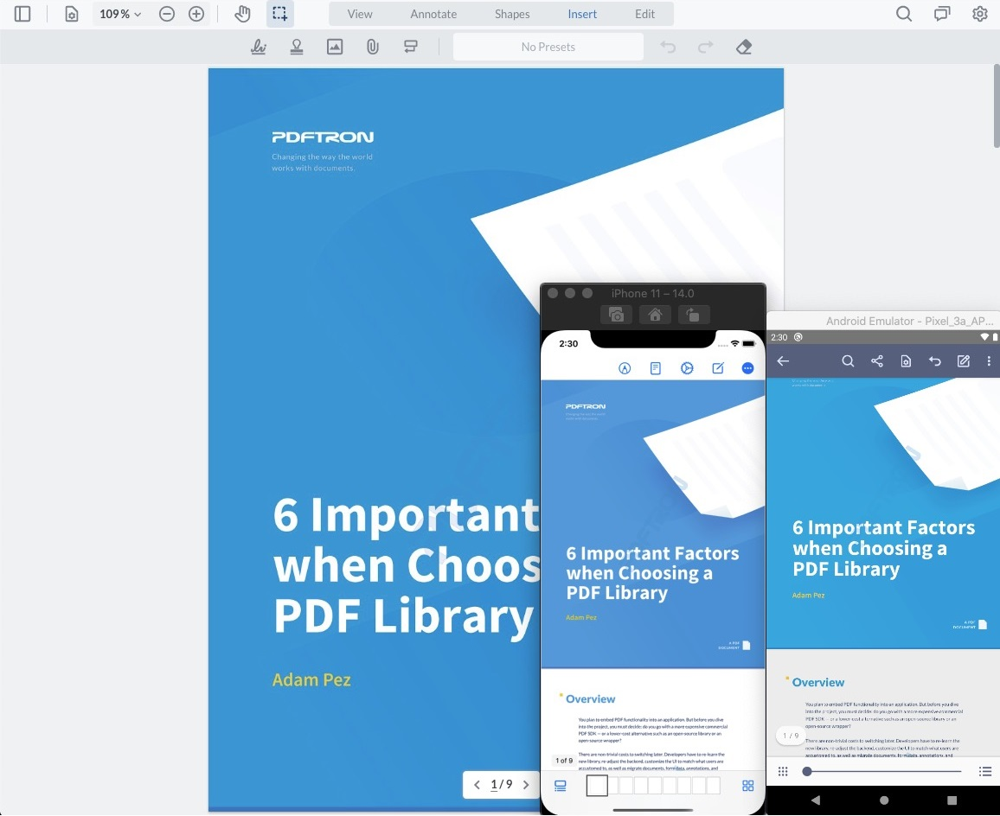

# PDFTron React and React Native PDF Viewer Sample

This sample project uses Expo and shows how to create a PDF viewer app for both web and mobile with a single codebase between React and React Native.




## Install

```
git clone https://github.com/PDFTron/pdftron-react-and-react-native-sample.git
cd pdftron-react-and-react-native-sample
npm install
```

## Run

### Web

```
npm run web
```

### iOS

1. Install dependencies

```
cd ios
pod install
cd ..
```

2.

```
npm run ios
```

### Android

1. Create a `local.properties` file inside the `android` folder with your Android SDK location, for example:

```
ndk.dir=/Users/pdftron/Library/Android/sdk/ndk-bundle
sdk.dir=/Users/pdftron/Library/Android/sdk
```

2.

```
npm run android
```

## Guides

- https://www.pdftron.com/documentation/web
- https://www.pdftron.com/documentation/ios
- https://www.pdftron.com/documentation/android

## Contributing

See [contributing](./CONTRIBUTING.md).

## License

See [license](./LICENSE).
